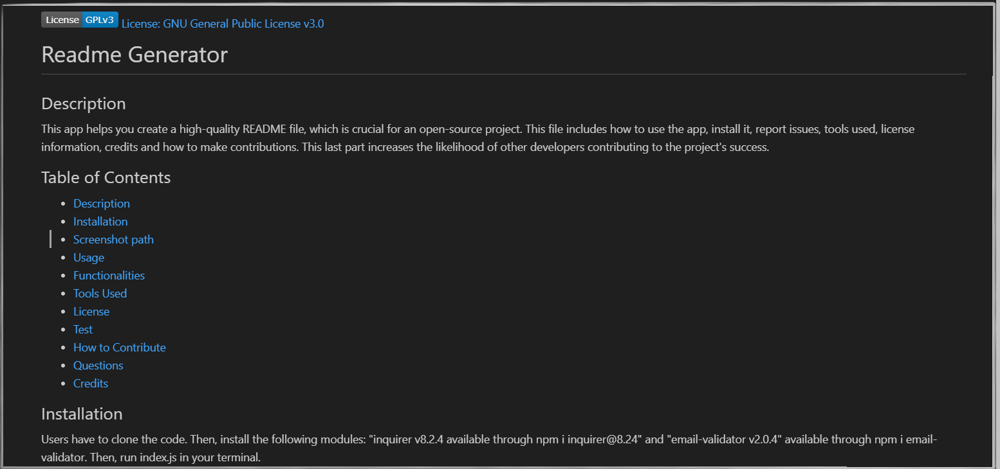

[License: GNU General Public License v3.0](https://www.gnu.org/licenses/gpl-3.0)

# Readme Generator

## Description
This app helps you create a high-quality README file, which is crucial for an open-source project. This file includes how to use the app, install it, report issues, tools used, license information, credits and how to make contributions. This last part increases the likelihood of other developers contributing to the project's success.

## Table of Contents
- [Readme Generator](#readme-generator)
  - [Description](#description)
  - [Table of Contents](#table-of-contents)
  - [Installation](#installation)
  - [Screenshot path](#screenshot-path)
  - [Usage](#usage)
  - [Functionalities](#functionalities)
  - [Tools Used](#tools-used)
  - [License](#license)
  - [Test](#test)
  - [How to Contribute](#how-to-contribute)
  - [Questions](#questions)
  - [Credits](#credits)

## Installation 
Users have to clone the code. Then, install the following modules: "inquirer v8.2.4 available through npm i inquirer@8.24" and "email-validator v2.0.4" available through npm i email-validator. Then, run index.js in your terminal. 

## Screenshot path
A screenshot is available 

Also, there is a video available at https://drive.google.com/file/d/1zbMnUkDVZ-qWs-b6J6wu3iNt5pfrz_bJ/view  or scanning this QR code .

## Usage
Users can quickly and easily create a README file by using a command-line application to generate one. Only answer every question, and the users will get the Readme file. Most of the questions have several validations to ensure quality and reliability. Please read the prompts carefully and answer according to them

## Functionalities
Email validation, license badge, and license link

## Tools Used
Node.js Module
undefined

## License

[License: GNU General Public License v3.0](https://www.gnu.org/licenses/gpl-3.0)

## Test
Please refer to this file's Installation and Usage section to run a test. 

## How to Contribute  
Users can collaborate with this project at https://github.com/gabrielparada05/Readme-generatorC9.

## Questions 
 Email: [gabrielparada05@gmail.com](mailto:gabrielparada05@gmail.com). Or, through my GitHub profile gabrielparada05, available at https://github.com/gabrielparada05.

## Credits
Gabriel Parada created this app. I used npm inquirer, npm email-validator and Markdown generator VSCode extension. Thank you to Scalahub (Github profile) for helping me with the badge license code. Also, thank you to Trinh Nguyen, UofT Tutor, for helping me debug my badge license code.  

